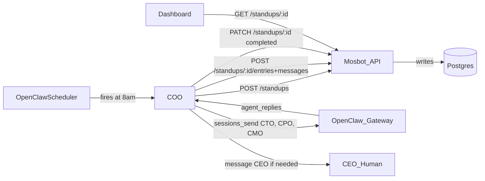
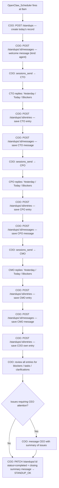

# Standups

Daily executive standups are a core operational feature of MosBot OS. The COO agent orchestrates the standup end-to-end: it opens the meeting, collects reports from each executive agent in sequence (CTO, CPO, CMO), writes a closing summary, resolves any blockers or clarifications, and notifies the CEO (human) only if something requires human attention.

## Table of Contents

- [How standups fit into MosBot OS](#how-standups-fit-into-mosbot-os)
- [Full standup flow](#full-standup-flow)
- [Data model](#data-model)
- [Standup lifecycle](#standup-lifecycle)
- [Participant order](#participant-order)
- [Prompt and response format](#prompt-and-response-format)
- [Scheduled generation (OpenClaw Scheduler)](#scheduled-generation-openclaw-scheduler)
- [Manual run via API](#manual-run-via-api)
- [Idempotency](#idempotency)
- [Failure handling](#failure-handling)
- [RBAC policy](#rbac-policy)
- [API quick reference](#api-quick-reference)

---

## How standups fit into MosBot OS



**Key responsibilities per layer:**

| Layer | Role |
| :--- | :--- |
| **OpenClaw Scheduler** | Fires the daily standup job at 8 AM via a cron job entry in `/cron/jobs.json` |
| **COO agent** | Owns the full standup flow: creates the record, collects reports, writes the summary, resolves blockers, escalates to CEO if needed |
| **CTO / CPO / CMO agents** | Respond to COO's standup prompt with their Yesterday / Today / Blockers report |
| **Mosbot API** | Persists standup records, entries, and messages; exposes REST endpoints for agents and the Dashboard |
| **OpenClaw Gateway** | Routes `sessions_send` calls from the COO to each agent's running session |
| **Postgres** | Source of truth for standup records, entries, and transcript messages |
| **Dashboard** | Human-facing read interface; displays standup entries and transcripts |

---

## Full standup flow

This is the canonical flow the COO agent follows every morning. The OpenClaw Scheduler triggers the job; the COO drives all subsequent steps autonomously.



### Step-by-step description

| Step | Actor | Action | API call |
| :--- | :--- | :--- | :--- |
| 1 | OpenClaw Scheduler | Fires the `daily-standup` cron job at 8 AM | — |
| 2 | COO | Creates today's standup record (`status: running`) | `POST /api/v1/standups` |
| 3 | COO | Posts a welcome/opening message to the transcript | `POST /api/v1/standups/:id/messages` |
| 4 | COO | Sends standup prompt to CTO via `sessions_send` | OpenClaw Gateway |
| 5 | CTO | Replies with Yesterday / Today / Blockers / Tasks | — |
| 6 | COO | Saves CTO's structured entry | `POST /api/v1/standups/:id/entries` |
| 7 | COO | Saves CTO's raw reply as a transcript message | `POST /api/v1/standups/:id/messages` |
| 8–11 | COO + CPO | Same as steps 4–7 for CPO | — |
| 12–15 | COO + CMO | Same as steps 4–7 for CMO | — |
| 16 | COO | Saves its own standup entry (turn_order 1) | `POST /api/v1/standups/:id/entries` |
| 17 | COO | Reviews all entries for outstanding tasks, blockers, or clarifications and responds accordingly | — |
| 18 | COO | If any issue requires human attention, sends a summary message to the CEO | Telegram / agent channel |
| 19 | COO | Posts a closing summary to the transcript | `POST /api/v1/standups/:id/messages` |
| 20 | COO | Marks standup completed; replies `STANDUP_OK` (or issue summary if CEO was notified) | `PATCH /api/v1/standups/:id` `status: completed` |

### COO standup prompt (sent to each agent)

```markdown
Please provide your daily standup report in the following format:

Yesterday: What you worked on yesterday
Today: What you plan to work on today
Blockers: Any blockers or issues to raise

Keep each section concise (2–3 sentences). Optionally include structured task references:
Tasks: [{"id": "TASK-123", "title": "...", "status": "..."}]
```

### COO closing behaviour

After all agents have reported, the COO:

1. Reviews all `yesterday`, `today`, and `blockers` fields across entries.
2. For any outstanding tasks or blockers, the COO responds directly (e.g. reassigns tasks, unblocks via sub-agent delegation, or flags for follow-up).
3. Evaluates whether any item requires CEO (human) attention — escalates by sending a concise summary message to the CEO channel.
4. Closes the standup with a brief summary message and marks `status: completed`.
5. Returns `STANDUP_OK` if no CEO escalation was needed, or a short issue summary if it was.

---

## Data model

Three tables store standup data. All foreign keys use `ON DELETE CASCADE`.

### `standups`

One row per calendar date (enforced by `UNIQUE (standup_date)`).

| Column | Type | Notes |
| :--- | :--- | :--- |
| `id` | UUID | Primary key |
| `standup_date` | DATE | Unique — one standup per day |
| `title` | TEXT | Human-readable title, e.g. `Executive Standup — Tuesday, February 18, 2026` |
| `timezone` | TEXT | Timezone in effect when the standup was generated |
| `status` | TEXT | `running` \| `completed` \| `error` |
| `started_at` | TIMESTAMPTZ | Set when collection begins |
| `completed_at` | TIMESTAMPTZ | Set when collection finishes (success or error) |
| `created_at` | TIMESTAMPTZ | |
| `updated_at` | TIMESTAMPTZ | Auto-updated via trigger |

### `standup_entries`

One row per agent per standup (enforced by `UNIQUE (standup_id, agent_id)`).

| Column | Type | Notes |
| :--- | :--- | :--- |
| `id` | UUID | Primary key |
| `standup_id` | UUID | FK → `standups.id` |
| `agent_id` | TEXT | Agent identifier, e.g. `coo`, `cto` |
| `user_id` | UUID \| null | FK → `users.id` — the agent's Mosbot user account |
| `turn_order` | INTEGER | Position in the standup (1 = COO, 2 = CTO, etc.) |
| `yesterday` | TEXT \| null | Parsed "Yesterday" section |
| `today` | TEXT \| null | Parsed "Today" section |
| `blockers` | TEXT \| null | Parsed "Blockers" section |
| `tasks` | JSONB \| null | Optional structured task references `[{"id":"TASK-123", "title":"...", "status":"..."}]` |
| `raw` | TEXT | Full raw response from the agent |
| `created_at` | TIMESTAMPTZ | |

### `standup_messages`

Full transcript — one row per message exchanged during the standup.

| Column | Type | Notes |
| :--- | :--- | :--- |
| `id` | UUID | Primary key |
| `standup_id` | UUID | FK → `standups.id` |
| `kind` | TEXT | `agent` \| `system` |
| `agent_id` | TEXT \| null | Agent that sent the message (`null` for system messages) |
| `content` | TEXT | Message body |
| `created_at` | TIMESTAMPTZ | |

> **Note**: The public API returns only `kind = 'agent'` messages by default (`GET /standups/:id`). System messages are stored but omitted from API responses. Use `GET /standups/:id/messages` (admin) to retrieve all kinds.

---

## Standup lifecycle

```bash
         ┌─────────────┐
         │  (no record) │
         └──────┬───────┘
                │  COO: POST /standups
                │  INSERT … ON CONFLICT DO UPDATE
                ▼
         ┌─────────────┐
         │   running   │  ← status set on creation
         └──────┬───────┘
                │  COO collects from CTO → CPO → CMO
                │  COO writes entries + messages per agent
                │  COO reviews, resolves, escalates if needed
                ▼
     ┌──────────────┐    agent error / timeout?    ┌───────┐
     │  completed   │ ◀─────────────────────────── │ error │
     └──────────────┘   individual agent failures   └───────┘
                        are recorded as "[Timeout …]"
                        in raw; standup still completes
```

---

## Participant order

The canonical standup order is defined by `STANDUP_AGENT_ORDER` in `src/services/standupService.js`:

```bash
Collection order:  CTO (1) → CPO (2) → CMO (3)
COO entry:         saved last as turn_order 1 (COO owns the standup)
```

The COO orchestrates collection but contributes its own entry after all other agents have reported. `turn_order` in `standup_entries` reflects the order entries were created, with COO stored at turn_order 1.

Only **active** users (`users.active = true`) with a recognised `agent_id` are included. If no agent users are found, the standup is marked `error`.

Agent users are identified by the `users.agent_id` column (e.g. `'coo'`). The user must:

- Exist in the `users` table
- Have `active = true`
- Have an `agent_id` matching one of: `coo`, `cto`, `cpo`, `cmo`

---

## Prompt and response format

The COO sends each reporting agent (CTO, CPO, CMO) the same structured prompt:

```bash
Please provide your daily standup report in the following format:

Yesterday: What you worked on yesterday
Today: What you plan to work on today
Blockers: Any blockers or issues to raise

Keep each section concise (2–3 sentences). Optionally add structured tasks:
Tasks: [{"id": "TASK-123", "title": "...", "status": "..."}]
```

### Parsing

`parseStandupResponse()` extracts named sections using regex:

- **Yesterday**, **Today**, **Blockers** — each captured as a multiline text block until the next section header appears.
- **Tasks** — optional JSON array parsed directly if present.
- **Fallback** — if no sections are detected, the entire response is stored in `today`.

Any response that fails to parse is still stored as-is in the `raw` column.

---

## Scheduled generation (OpenClaw Scheduler)

Standups are triggered by the **OpenClaw Scheduler** — a cron job defined in the OpenClaw workspace file `/cron/jobs.json` and executed by the OpenClaw Gateway. There is no internal Node.js scheduler in Mosbot API.

### How to configure the daily standup job

Add (or verify) a cron job entry in `/cron/jobs.json` via the Dashboard's Cron Jobs UI or directly via `POST /api/v1/openclaw/cron`:

```json
{
  "name": "daily-standup",
  "description": "Trigger daily executive standup collection",
  "schedule": {
    "kind": "cron",
    "expr": "0 8 * * *",
    "tz": "Asia/Singapore"
  },
  "agentId": "coo",
  "sessionTarget": "isolated",
  "payload": {
    "kind": "agentTurn",
    "message": "Run the daily standup. Create a new standup record for today via POST /api/v1/standups, then run it via POST /api/v1/standups/:id/run using your agent credentials."
  },
  "enabled": true
}
```

The `tz` field controls which timezone the cron expression fires in. Use the same timezone as your Mosbot instance (`GET /api/v1/config` returns the configured timezone).

### Flow when the scheduled job fires

1. OpenClaw Scheduler fires the `daily-standup` job at 8 AM.
2. COO creates today's standup record (`POST /api/v1/standups`, `status: running`) and posts a welcome message.
3. COO contacts CTO, CPO, and CMO in sequence via `sessions_send`, saving each agent's entry and message to the API.
4. COO saves its own standup entry.
5. COO reviews all entries — resolves blockers, responds to outstanding tasks, and escalates to the CEO if human attention is needed.
6. COO posts a closing summary, marks the standup `completed`, and replies `STANDUP_OK` (or an issue summary if CEO was notified).

---

## Manual run via API

Any standup record (regardless of date) can be re-run manually:

```bash
POST /api/v1/standups/:id/run
Authorization: Bearer <admin|agent|owner JWT>
```

This is useful for:

- Retrying a failed (`status = error`) standup.
- Running a standup off-schedule (e.g. after config changes).
- Testing standup collection in development.

The endpoint fetches the standup record, calls `runStandupById()`, and returns the updated standup.

---

## Idempotency

Re-running a standup (either via the OpenClaw Scheduler or `POST /run`) is fully idempotent:

1. The `standups` row is upserted (`ON CONFLICT DO UPDATE`) by date — no duplicate standup rows.
2. Before writing new entries and messages, the service **deletes all existing `standup_entries` and `standup_messages`** for the standup within a single database transaction.
3. Fresh entries and messages are written in the same transaction.
4. If the transaction fails, it is rolled back and the standup is marked `error`.

The `UNIQUE (standup_id, agent_id)` constraint on `standup_entries` acts as an additional safety net against partial duplicate inserts.

---

## Failure handling

| Failure scenario | Result |
| :--- | :--- |
| No active agent users in DB | Standup marked `error`, collection aborted |
| Individual agent timeout | Response stored as `[Timeout after Ns — no response]`; collection continues |
| Individual agent error reply | Response stored as `[Error: ...]`; collection continues |
| `sessions_send` not available | Response stored as `[Error: sessions_send tool not available ...]`; collection continues |
| Transaction failure during persist | Transaction rolled back; standup marked `error` |
| Unhandled exception in collection | Best-effort: any `running` standup for today is marked `error` |

---

## RBAC policy

Standup endpoints follow the standard MosBot API RBAC pattern:

| Operation | Required role |
| :--- | :--- |
| `GET /standups` | Any authenticated user |
| `GET /standups/latest` | Any authenticated user |
| `GET /standups/:id` | Any authenticated user |
| `GET /standups/:id/entries` | Any authenticated user |
| `GET /standups/:id/messages` | Any authenticated user |
| `POST /standups` | `owner`, `agent`, or `admin` |
| `PATCH /standups/:id` | `owner`, `agent`, or `admin` |
| `DELETE /standups/:id` | `owner`, `agent`, or `admin` |
| `POST /standups/:id/run` | `owner`, `agent`, or `admin` |
| `POST /standups/:id/entries` | `owner`, `agent`, or `admin` |
| `PATCH /standups/:id/entries/:entryId` | `owner`, `agent`, or `admin` |
| `DELETE /standups/:id/entries/:entryId` | `owner`, `agent`, or `admin` |
| `POST /standups/:id/messages` | `owner`, `agent`, or `admin` |
| `DELETE /standups/:id/messages/:messageId` | `owner`, `agent`, or `admin` |

---

## API quick reference

See [docs/api/openclaw-public-api.md](../api/openclaw-public-api.md) for full request/response shapes.

### Read endpoints (any authenticated user)

| Method | Path | Description |
| :--- | :--- | :--- |
| `GET` | `/api/v1/standups` | List standups (newest first, paginated) |
| `GET` | `/api/v1/standups/latest` | Most recent standup (list shape, no entries/messages) |
| `GET` | `/api/v1/standups/:id` | Standup with full entries + agent transcript messages |
| `GET` | `/api/v1/standups/:id/entries` | Standup entries only |
| `GET` | `/api/v1/standups/:id/messages` | All transcript messages (including system) |

### Write endpoints (admin/agent/owner)

| Method | Path | Description |
| :--- | :--- | :--- |
| `POST` | `/api/v1/standups` | Create a standup record |
| `PATCH` | `/api/v1/standups/:id` | Update standup fields |
| `DELETE` | `/api/v1/standups/:id` | Delete standup (cascades entries + messages) |
| `POST` | `/api/v1/standups/:id/run` | Run standup collection via OpenClaw |
| `POST` | `/api/v1/standups/:id/entries` | Manually add a standup entry |
| `PATCH` | `/api/v1/standups/:id/entries/:entryId` | Update a standup entry |
| `DELETE` | `/api/v1/standups/:id/entries/:entryId` | Delete a standup entry |
| `POST` | `/api/v1/standups/:id/messages` | Manually add a transcript message |
| `DELETE` | `/api/v1/standups/:id/messages/:messageId` | Delete a transcript message |
